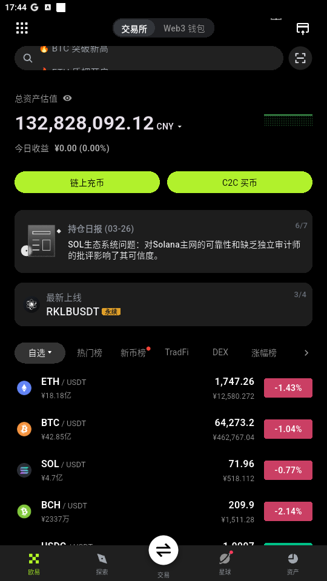
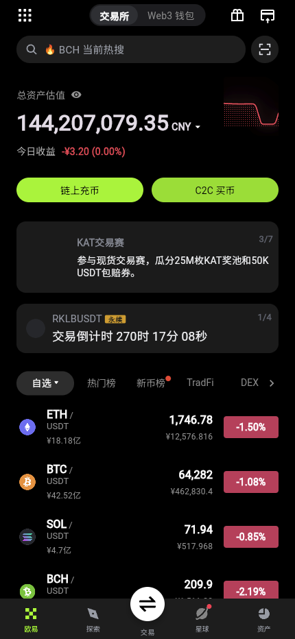
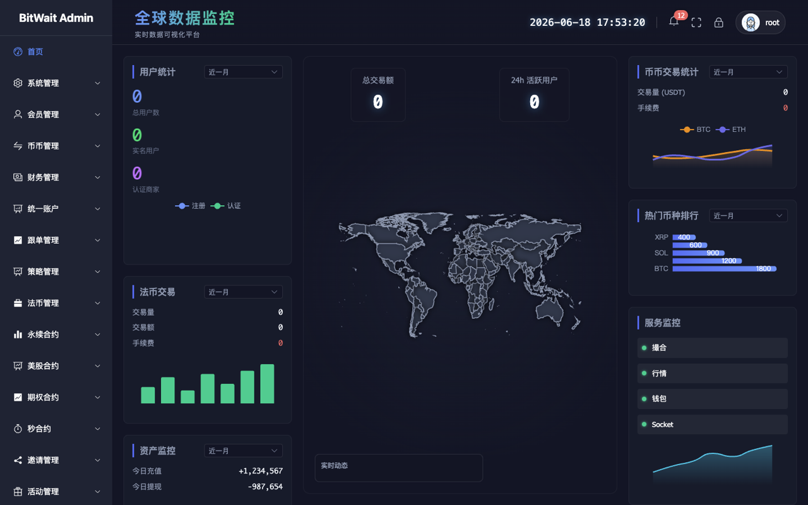

# OKX Exchange Demo Builds

OKX 风格数字资产交易平台演示构建，包含 Vue 3.5 Web 生产包、Flutter Android APK、Flutter H5 生产包，以及 Web、H5、移动端和管理后台演示素材。

> 本仓库仅发布编译产物与演示媒体，不包含 Vue、Flutter、后端或其他业务源码。本项目为非官方技术演示，与 OKX 官方无隶属或授权关系，请勿用于违法违规用途。

## 下载

当前版本：`v1.0.0`（2026-07-22）

| 平台 | 构建产物 | 说明 |
| --- | --- | --- |
| Web | [okx-web-dist-v1.0.0.zip](https://github.com/kuuliaocom/okx-exchange/releases/download/v1.0.0/okx-web-dist-v1.0.0.zip) | Vue 3.5 生产环境 `dist`，解压后使用静态 Web 服务器部署 |
| Android | [okx-android-v1.0.0-demo.apk](https://github.com/kuuliaocom/okx-exchange/releases/download/v1.0.0/okx-android-v1.0.0-demo.apk) | Flutter release APK，Android 7.0+，演示签名 |
| H5 | [okx-flutter-h5-v1.0.0.zip](https://github.com/kuuliaocom/okx-exchange/releases/download/v1.0.0/okx-flutter-h5-v1.0.0.zip) | Flutter Web release 构建，支持静态站点部署 |
| 校验文件 | [SHA256SUMS.txt](https://github.com/kuuliaocom/okx-exchange/releases/download/v1.0.0/SHA256SUMS.txt) | 三个发布包的 SHA256 校验值 |

所有大体积构建产物通过 [GitHub Release v1.0.0](https://github.com/kuuliaocom/okx-exchange/releases/tag/v1.0.0) 发布，避免将二进制文件写入 Git 历史。

## Web 演示


[观看 Web 演示视频](demo/videos/web-demo.mp4)

## 移动端演示

<p align="center">
  
  
</p>

- [观看 Flutter 移动端演示视频](demo/videos/mobile-demo.mp4)
- [观看 H5 演示视频](demo/videos/h5-demo.mp4)

## 管理后台演示



[观看管理后台演示视频](demo/videos/admin-demo.mp4)

## 2026-07-22 更新进度

- **Vue 3.5 Web 生产包**：已完成 Node.js 20 环境下的类型检查与 Vite production 构建，覆盖响应式导航、行情、交易、资产、P2P、机构业务、策略和社区等演示页面。
- **Web 发布净化**：发布压缩包仅保留浏览器运行所需的编译文件，已排除 TypeScript 声明文件、source map 和系统元数据。
- **Flutter Android**：已完成 Flutter 3.41.4 / Dart 3.11.1 release 构建，版本 `1.0.0 (1)`，包名 `com.okinc.okexgp`，最低 Android API 24，目标 API 34。
- **Flutter H5**：已完成 Flutter Web JavaScript release 构建；发布包已排除 CanvasKit symbol、source map、声明文件和构建缓存元数据。
- **演示素材**：新增 Web、Flutter、H5、管理后台四组 H.264 MP4 演示视频与预览图。
- **源码隔离**：Git 提交与 Release 资产均不包含应用源码、测试源码、构建脚本、服务端配置或密钥。

## 功能展示范围

- Web：现货/合约交易工作台、K 线与盘口、市场行情、P2P、资产账户、策略、机构业务、社区与响应式导航。
- Flutter：行情、现货/合约/策略交易、资产、充提与划转、C2C、探索、星球社区、登录与个人中心。
- 管理后台：用户、币币、财务、合约、策略、邀请、活动和服务状态等可视化管理界面。

演示构建用于界面和流程展示，实际可用功能取决于部署环境中的后端 API、行情 WebSocket、对象存储及其他服务配置。

## 构建信息

| 项目 | 工具链 | 构建结果 |
| --- | --- | --- |
| Vue Web | Node.js 20.10.0、Vue 3.5、Vite 5.4 | 类型检查通过，production build 通过 |
| Android | FVM、Flutter 3.41.4、Dart 3.11.1、Gradle 8.11.1 | release APK 构建通过 |
| Flutter H5 | FVM、Flutter 3.41.4、Dart 3.11.1 | JavaScript release build 通过 |

## 安装与部署提示

### Web

解压 `okx-web-dist-v1.0.0.zip` 后，将其中的 `dist/` 部署到 Nginx、CDN 或其他静态 Web 服务器。单页应用路由需要配置回退到 `index.html`。

### Android

APK 使用工程现有的演示签名配置，不应直接用于应用商店或生产分发。生产发布前请使用自己的 keystore 重新签名，并按需调整应用 ID、显示名称和服务端地址。

### H5

解压 `okx-flutter-h5-v1.0.0.zip` 后，将其中的 `h5/` 部署到静态 Web 服务器。构建的 `base href` 为 `/`，如果部署到子目录，需要按目标路径重新构建或调整基础路径与静态资源路由。

## 文件校验

下载后可执行：

```bash
shasum -a 256 -c SHA256SUMS.txt
```

已知校验值：

```text
58c9db5d894cfc0cff2ec651e9c3222fb64bb792ec24090786723fbaf2dfff4e  okx-web-dist-v1.0.0.zip
775bcd2f116de40504cb17d3ea94b155da31a5a736a6db1844f4cd2d0905bdee  okx-android-v1.0.0-demo.apk
6a0353c039488826dda88c9c8d9c5ae7079d49fd7f277b165c752e0f696205f3  okx-flutter-h5-v1.0.0.zip
```

## 声明

- 仅供技术研究、产品演示与合法的内部测试使用。
- 不提供任何投资、交易或收益承诺。
- 不得用于钓鱼、欺诈、冒充官方产品或其他违法行为。
- 品牌名称及相关标识归其各自权利人所有。
